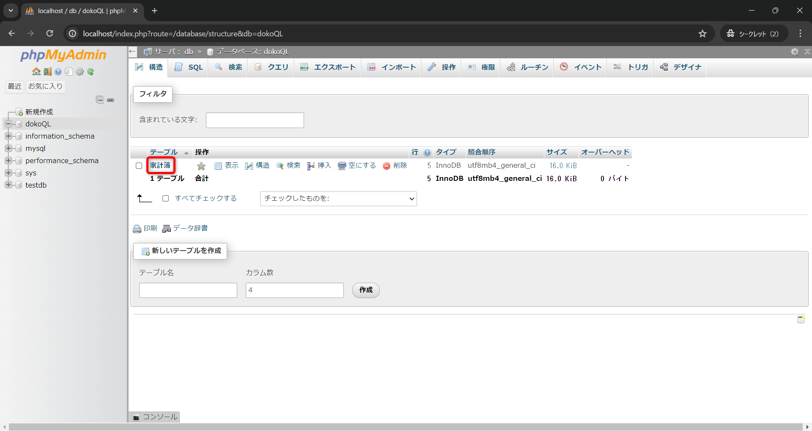
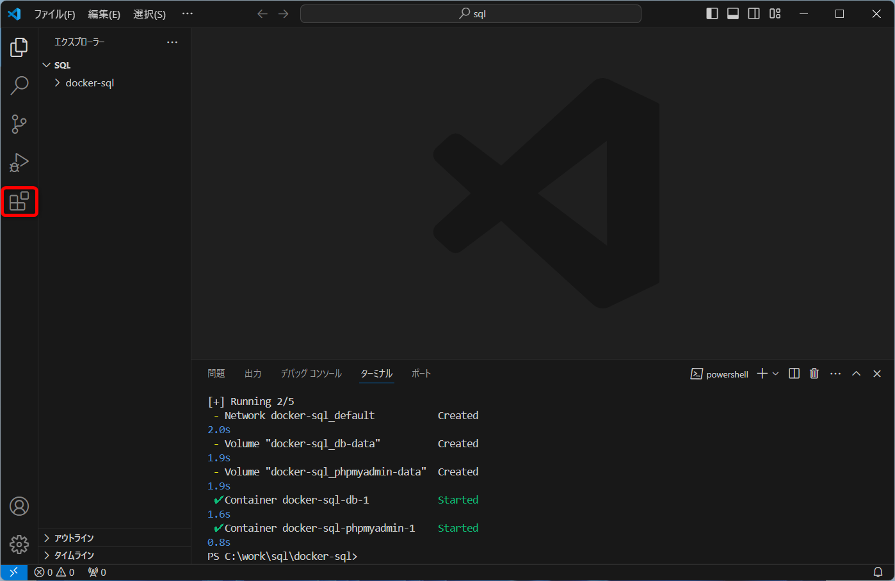

# SQL

## 使用するテキスト

[スッキリわかるSQL入門 第4版 ドリル256問付き！](https://book.impress.co.jp/books/1123101107)

## 開発環境

- Visual Studio Code
- Docker
  - MySQL
  - phpMyAdmin

## 開発環境の構築手順

###  Visual Studio Codeインストール

[こちらを参照](https://github.com/room202/vscode/)

- 拡張機能を追加
  - MySQL(cweijan.vscode-mysql-client2)

###  Dockerインストール

[こちらを参照](https://github.com/room202/docker/)

## ソースコードの保存場所

`C:\work\sql`

※当該フォルダが無ければ作る

分からない人は[こちら](https://github.com/room202/work-dir-prepare)を参照

## Dockerの起動方法

### Dockerに必要なファイルを用意 (1回だけやればOK)

下記Zipファイルをダウンロード  
https://github.com/room202/sql/raw/main/docker-sql.zip

`C:\work\sql`内に解凍(展開)する

`C:\work\sql\docker-sql\compose.yml`となればOK

### Docker Desktopを起動

Windowsスタートボタンの右横にある検索バーで「Docker」と検索する   


起動後は最小化しておく  


### Dockerを起動する

Visual Studio Codeで

`C:\work\sql`フォルダを開く  


メニューバーの`ターミナル`から`新しいターミナル`をクリック  
  


`ターミナル`から下記コマンドを実行

  ```bash
  cd docker-sql
  docker compose up -d
  ```


Dockerの起動準備が始まる  


このような画面になったら起動完了  


コマンドの解説

 ```bash
# Docker設定ファイルのあるフォルダに移動
cd docker-sql

# Docker起動
docker compose up -d

# Docker終了
docker compose down
```

## 授業用のデータベース作成 (1回だけやればOK)

### phpMyAdminへアクセスする  

http://localhost/


`SQL`タブをクリック  


クエリ入力欄に下記をコピペして`実行`をクリック

```sql
-- `dokoSQL` データベーステーブルの作成
CREATE DATABASE `dokoQL` DEFAULT CHARACTER SET utf8mb4 COLLATE utf8mb4_general_ci;
```


左のメニューから`dokoQL`をクリック  


`SQL`タブをクリック  


クエリ入力欄に下記をコピペして`実行`をクリック

```sql
-- `家計簿` テーブルの作成 
CREATE TABLE IF NOT EXISTS `家計簿` (
  `日付` date DEFAULT NULL,
  `費目` varchar(20) DEFAULT NULL,
  `メモ` varchar(100) DEFAULT NULL,
  `入金額` int(11) DEFAULT NULL,
  `出金額` int(11) DEFAULT NULL
) ENGINE=InnoDB DEFAULT CHARSET=utf8;
```


`SQL`タブをクリック  


クエリ入力欄に下記をコピペして`実行`をクリック

```sql
-- `家計簿` テーブルにデータ追加
INSERT INTO `家計簿` (`日付`, `費目`, `メモ`, `入金額`, `出金額`) VALUES
('2024-02-03', '食費', 'コーヒーを購入', 0, 380),
('2024-02-10', '給料', '1月の給料', 280000, 0),
('2024-02-11', '教養娯楽費', '書籍を購入', 0, 2800),
('2024-02-14', '交際費', '同期会の会費', 0, 5000),
('2024-02-18', '水道光熱費', '1月の電気代', 0, 7560);
```


`構造`タブをクリック  


`家計簿`をクリック  


データが追加されていればOK  


## 拡張機能のMySQLの設定

### インストール

`拡張機能`ボタンをクリック  


検索エリアに`MySQL`もしくは`cweijan.vscode-mysql-client2`と入力し、  
該当の拡張機能`MySQL`の`インストール`をクリック  


`拡張機能 MySQL`のタブは`✕`をクリックして閉じる  


左側にデータベース(Database)アイコンが追加されるので、それをクリック   


`Create Connection`をクリック  
※Dockerが起動してphpMyAdminが表示されている事が前提  


`Password`にlightboxのパスワードを入力して、「+ Connect」をクリック  


`Success!`と表示されたらOK  


左側の`DATABASE`エリアに`dokoQL`が表示されていたらOK  


`dokoQL`をクリックして`Tables`の中の`家計簿`を開くとデータが表示されたらOK  


